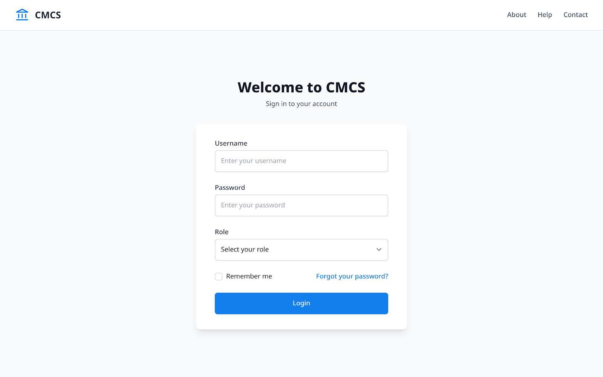
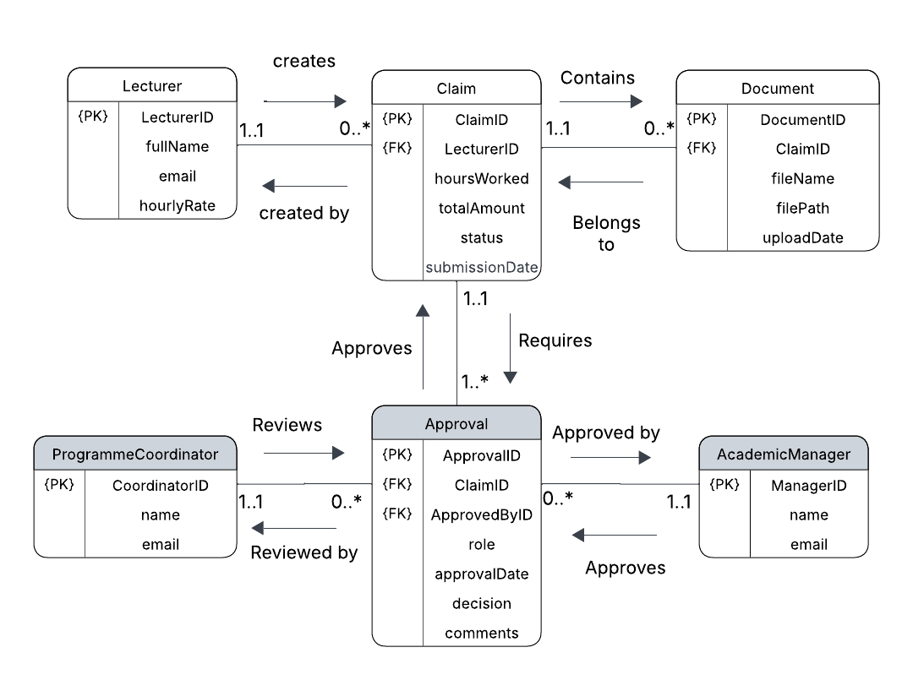

# 📘 Contract Monthly Claim System (CMCS)

The **Contract Monthly Claim System (CMCS)** is a university project designed to streamline the submission, review, and approval of Independent Contractor (IC) lecturer claims.  
This prototype focuses on **planning, UML design, project scheduling, and GUI wireframes** to demonstrate how such a system would work in practice.

---

## 📂 Project Overview
The current CMCS prototype is part of a **6-week academic project** (PROG6212 POE).  
It addresses the inefficiencies of manual, paper-based claim submissions by providing:  
- A **Lecturer Portal** for submitting claims and uploading supporting documents.  
- A **Coordinator Dashboard** for reviewing submitted claims.  
- A **Manager Dashboard** for final approval/rejection.  
- A **Transparent Workflow** with claim statuses visible at all stages.

---

## 🎯 Features (Prototype Scope)
✅ Lecturer: Submit claims with hours worked, hourly rate, and attached documents.  
✅ Coordinator: Review pending claims and approve/reject.  
✅ Manager: Perform final approvals and manage escalations.  
✅ Claim Tracking: Status updates at each stage.  
✅ Role-Based Login: Lecturer, Coordinator, Manager access separated.  
✅ Clean & Modern UI: Blue/white theme with accessibility features (large text, contrast).  

---

## 🗂 Deliverables
This repo contains:
- **UML Class Diagram** – database structure with entities, PK/FK keys, and relationships.  
- **Project Plan (Gantt Chart)** – 6-week timeline with dependencies and milestones.  
- **GUI Wireframes** – dashboards for lecturers, coordinators, and managers.  
- **Documentation (POE Part 1 Report)** – design choices, assumptions, constraints, and references.  

---

## 📊 Project Plan
- **Weeks 1–2** → Planning, UML, documentation, GUI mockups, version control setup.  
- **Weeks 3–4** → Prototype implementation (claims, uploads, approvals, unit tests).  
- **Weeks 5–6** → Automation (auto-calculations, reporting, HR export), final presentation.  

---

## 🖼 Screenshots
### Login Page

### Lecturer Dashboard

### Coordinator Dashboard

### Manager Dashboard

---

## 🧩 UML Diagram

---

## 🛠️ Tech Stack
- **Design Tools**: Figma (UI mockups), Graphviz/Draw.io (UML)  
- **Planning**: Jira-style Gantt chart (CSV import)  
- **Languages**: Documentation only (future parts will include C# & .NET)  
- **Version Control**: Git + GitHub  

---

## 📑 Documentation
The full Part 1 report (with Introduction, Design Choices, UML, Project Plan, GUI, and AI Disclosure Annexure) is included in `/docs`.

---

## 🤖 AI Usage
Some sections of the documentation were refined with **ChatGPT (OpenAI GPT-5)** to improve structure and clarity.  
All usage is disclosed in the **AI Disclosure Annexure** in `/docs`.  

---

## 📌 Status
🔹 Part 1: **Planning & Design – Complete**  
🔹 Part 2: **Prototype Implementation – Upcoming**  
🔹 Part 3: **Automation & Final Presentation – Upcoming**  

---

## 👤 Authors
- **Jeron Okkers** – Varsity College Student, Contract Monthly Claim System Project  

---

## 📜 License
This project is for **educational purposes** only (Varsity College – PROG6212 POE).  
Not intended for production use.  
