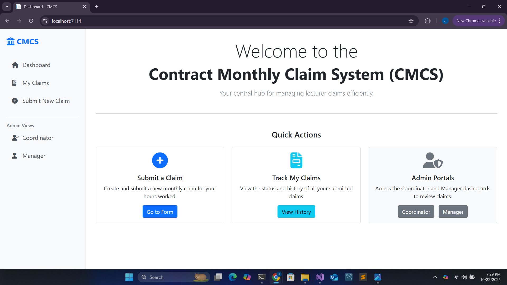
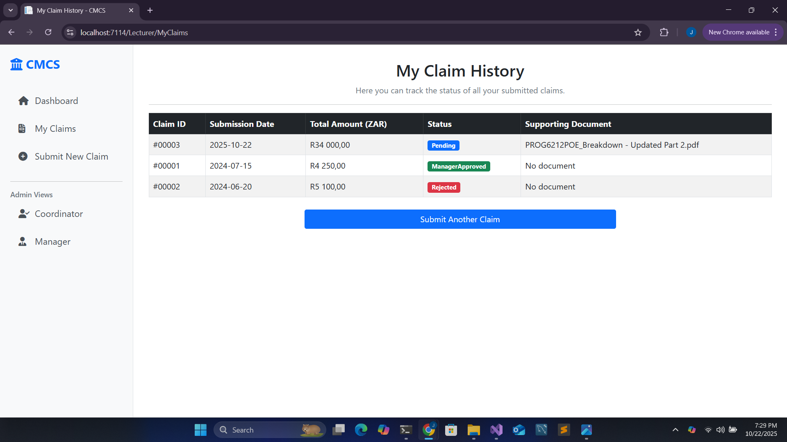
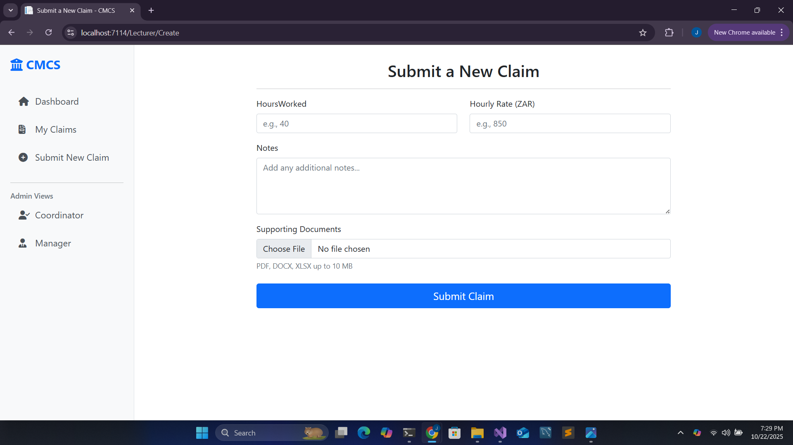
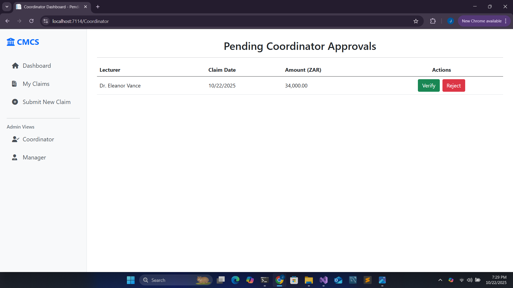
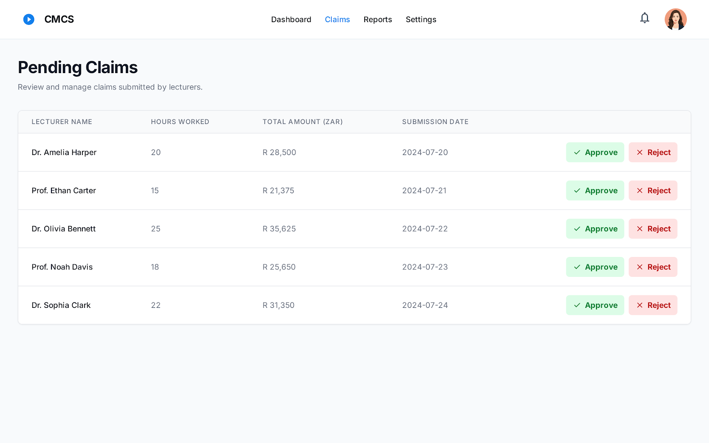

# 📘 Contract Monthly Claim System (CMCS)

The **Contract Monthly Claim System (CMCS)** is a university project designed to streamline the submission, review, and approval of Independent Contractor (IC) lecturer claims. This repository contains the functional prototype for **Part 2 of the PROG6212 Portfolio of Evidence**.

---

## ✨ Part 2: Functional Prototype

[cite_start]Building on the initial design from Part 1, this version is a fully functional web application developed with **ASP.NET Core MVC**[cite: 186]. The application brings the wireframes to life, implementing the core workflows for lecturers and administrators. [cite_start]To meet the specific requirements of this phase, the application uses **in-memory data storage** to manage claims and secures uploaded documents with **AES encryption**[cite: 666, 675].

---

## 🎥 YouTube Demonstration

A detailed video walkthrough of the application's features and functionality is available on YouTube. [cite_start]The video demonstrates the complete claim submission and approval workflow. [cite: 229]

**[Link to Your Unlisted YouTube Video Here]**

---

## 🎯 Key Features Implemented

The prototype now includes the following functional features:

* [cite_start]**Lecturer Claim Submission:** A user-friendly form allows lecturers to submit claims with details for hours worked, hourly rate, and any additional notes[cite: 191, 192]. The form includes robust validation to ensure data accuracy.
* [cite_start]**Secure Document Uploads:** Lecturers can upload supporting documents for their claims[cite: 200]. [cite_start]The system validates files by type (allowing only `.pdf`, `.docx`, `.xlsx`) and size (max 10MB)[cite: 207]. [cite_start]Uploaded files are securely stored using AES encryption to protect sensitive information[cite: 204].
* [cite_start]**Claim Status Tracking:** After submission, lecturers can track the real-time status of their claims on a dedicated "My Claims" page[cite: 212, 213]. [cite_start]The status is clearly displayed (e.g., `Pending`, `CoordinatorApproved`, `ManagerApproved`, `Rejected`)[cite: 215].
* **Two-Step Admin Approval Workflow:**
    * [cite_start]**Coordinator View:** A dedicated dashboard for Programme Coordinators to review and either **verify or reject** all *newly submitted* claims[cite: 194].
    * [cite_start]**Manager View:** A separate dashboard for Academic Managers to provide **final approval or rejection** for claims that have already been verified by a coordinator[cite: 194].
* [cite_start]**Unit Tested Logic:** The core business logic within the data service is covered by a suite of **5+ unit tests** to ensure reliability and correctness[cite: 219, 693].
* **Modern Sidebar UI:** The application features a professional and intuitive user interface with a vertical sidebar for easy navigation across all user roles.

---

## 🛠️ Tech Stack

-   [cite_start]**Backend:** C# 12, ASP.NET Core MVC (.NET 8) [cite: 186]
-   **Frontend:** HTML5, CSS3, Bootstrap 5
-   [cite_start]**Data Management:** In-memory data storage (Static List) [cite: 666]
-   [cite_start]**Security:** AES Encryption for file storage (`System.Security.Cryptography`) [cite: 675]
-   [cite_start]**Testing:** MSTest for Unit Testing [cite: 219]
-   **Version Control:** Git & GitHub

---

## 🖼 Screenshots

### Home Page Dashboard
 ### Lecturer - Submit Claim

### Lecturer - My Claims
 ### Coordinator Dashboard

### Manager Dashboard

---

## 🤖 AI Usage

For Part 2 of this project, AI assistance (Gemini by Google) was used for:
-   Generating boilerplate code for controllers, views, and services.
-   Developing the AES file encryption/decryption logic.
-   Debugging the HTTP 400 error related to large file uploads.
-   Refining unit tests to cover key functionality.
-   Drafting this `README.md` file.

[cite_start]*As per the assignment instructions, full disclosure including screenshots of conversations and links will be provided in a separate document or annexure.* [cite: 101]

---

## 📌 Status

* 🔹 Part 1: Planning & Design – ✅ **Complete**
* 🔹 Part 2: Functional Prototype – ✅ **Complete**
* 🔹 Part 3: Automation & Final Presentation – ⏳ **Upcoming**

---

## 👤 Author

-   **Jeron Okkers** – Varsity College Student, PROG6212 POE Project
