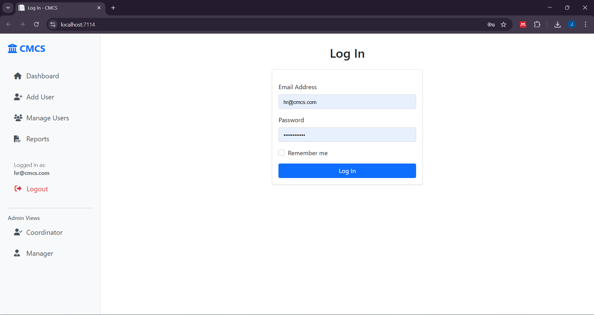
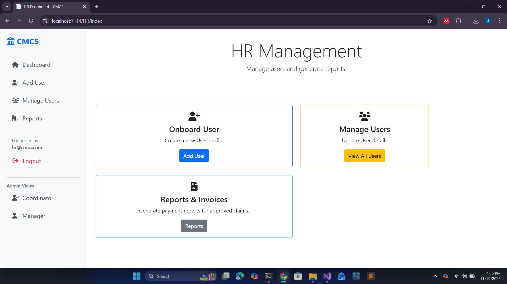
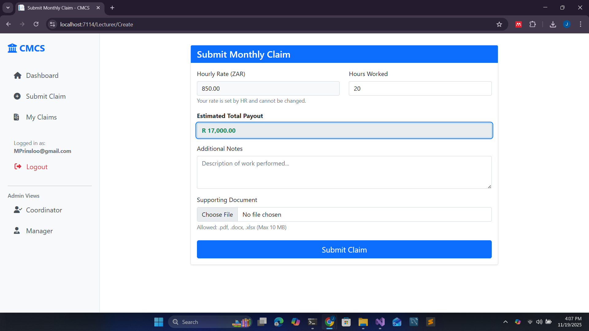
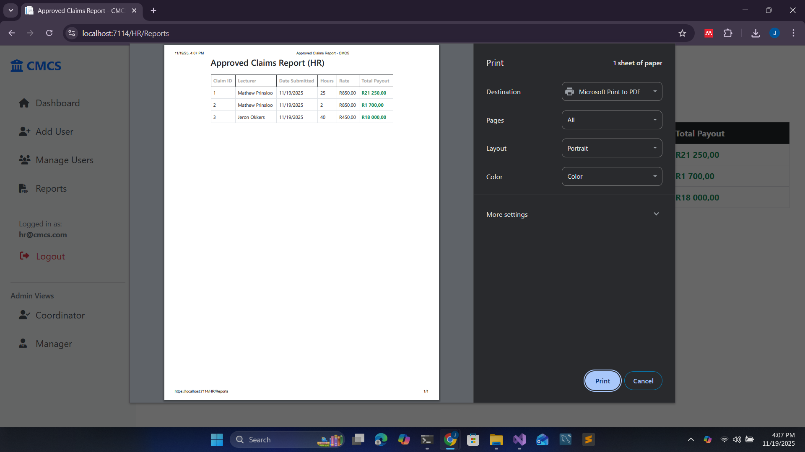

# 📘 Contract Monthly Claim System (CMCS)

The **Contract Monthly Claim System (CMCS)** is a comprehensive web application designed to streamline the submission, review, and approval of Independent Contractor (IC) lecturer claims. This repository contains the **Final Production Version (Part 3)** of the PROG6212 Portfolio of Evidence.

---

## 🚀 Part 3: Final Automation & Database Integration

Moving beyond the prototype phase, Part 3 transforms the system into a robust, database-driven application. Key upgrades include **Persistent Data Storage** using SQL Server, **Role-Based Security** using ASP.NET Identity, and **Process Automation** to minimize human error.

---

## 🎥 YouTube Demonstration

A detailed video walkthrough of the final application features and functionality is available on YouTube.
**[LINK TO YOUR VIDEO HERE]**

---

🔐 System Login Accounts (For Lecturer Review)
----------------------------------------------

The following test accounts were created for marking and demonstration purposes.\
Each account has a predefined role to showcase the full workflow of the system.

### **HR (Super User)**

-   **Email:** `hr@cmcs.com`

-   **Password:** `Password@123`

-   **Role:** `HR`\
    ➡ Full access to User Management, Reporting, and System Administration.

* * * * *

### **Lecturer (Customer)**

-   **Email:** `MPrinsloo@gmail.com`

-   **Password:** `Mathew123*`

-   **Role:** `Lecturer`\
    ➡ Can submit monthly claims and track approval progress.

* * * * *

### **Coordinator**

-   **Email:** `coordinator@cmcs.com`

-   **Password:** `Password@123`

-   **Role:** `Coordinator`\
    ➡ Can verify claims that are marked as *Pending*.

* * * * *

### **Manager**

-   **Email:** `manager@cmcs.com`

-   **Password:** `Password@123`

-   **Role:** `Manager`\
    ➡ Final approval authority for verified claims.

## 🎯 Key Features Implemented

### 1. Role-Based Security & Identity
* **Secure Login:** Implemented **ASP.NET Core Identity** for secure authentication.
* **Granular Access:** Four distinct roles with specific permissions:
    * **HR:** Super User for user management and reporting.
    * **Lecturer:** Can only submit and track their own claims.
    * **Coordinator:** Can only verify pending claims.
    * **Manager:** Can only grant final approval.

### 2. HR "Super User" Automation
* **User Management:** HR administrators can onboard new lecturers and define their **Hourly Rates** securely.
* **Rate Locking:** To prevent fraud, the hourly rate is locked in the database and cannot be edited by lecturers.
* **Reporting:** HR can generate professional "Approved Claims" reports using a print-friendly PDF view.

### 3. Lecturer Automation & Validation
* **Auto-Calculations:** The claim submission form automatically pulls the lecturer's official rate and calculates the total payout in real-time using jQuery.
* **Business Rules:** Backend validation strictly enforces a limit of **180 hours per month**.
* **Secure Uploads:** AES-Encrypted document storage for supporting files (PDF/DOCX/XLSX).

### 4. Approval Workflow
* **Persistent State:** Unlike the Part 2 in-memory list, all claims and approval statuses are now stored permanently in a **SQL Server Database**.
* **Workflow:** `Pending` -> `Coordinator Verified` -> `Manager Approved` -> `Paid`.

---

## 🛠️ Tech Stack

-   **Framework:** ASP.NET Core MVC (.NET 8)
-   **Database:** SQL Server LocalDB (Entity Framework Core Code-First)
-   **Authentication:** Microsoft.AspNetCore.Identity
-   **Frontend:** HTML5, Bootstrap 5, jQuery
-   **Security:** AES Encryption & Role-Based Authorization (`[Authorize]`)
-   **Testing:** MSTest (Unit Testing)

---

## 🖼 Screenshots

### Login Screen

### HR Dashboard (User Management)

### Lecturer - Submit Claim (Auto-Calculated)

### Approved Claims Report

---

## 🤖 AI Assistance Overview

For Part 3 of this project, AI assistance was used for:
-   Configuring the `DbSeeder` to create default Admin/HR accounts.
-   Writing the jQuery script for the client-side "Total Payout" calculation.
-   Designing the CSS `@media print` query for the PDF reporting feature.
-   Troubleshooting Entity Framework relationship errors.

AI was used as a support tool during the development of the Contract Monthly Claim System (CMCS). It helped me with:

-   Debugging errors and fixing issues in controllers, Identity setup, and Entity Framework.

-   Improving code structure and ensuring proper use of MVC and dependency injection.

-   Generating small code snippets for role seeding, validation rules, and jQuery auto-calculation.

-   Enhancing documentation and helping structure my README and presentation.

-   Clarifying best practices for security, automation, and database integration.

AI assisted me in understanding concepts and improving implementation, but **all final coding, integration, testing, and design decisions were done by me**

Chatgpt link- https://chatgpt.com/s/t_691f74b19c18819194d6850ceb1bd7f7

---

## 📌 Status

* 🔹 Part 1: Planning & Design – ✅ **Complete**
* 🔹 Part 2: Functional Prototype – ✅ **Complete**
* 🔹 Part 3: Automation & Final Presentation – ✅ **Complete**

---

## 👤 Author

-   **Jeron Okkers** – Varsity College Student, PROG6212 POE Project
